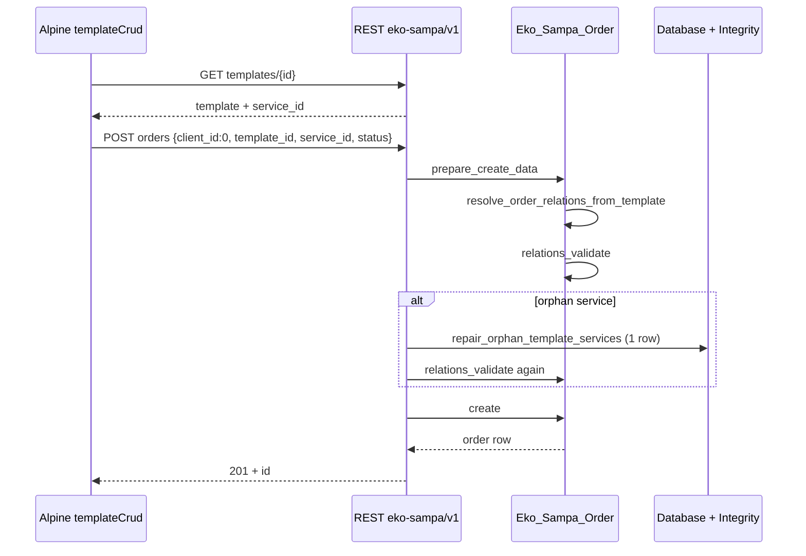

# Visão geral da arquitetura

## Propósito

Plugin WordPress **frontend-first** para templates de impressão (JSON), clientes, serviços com campos dinâmicos, templates e orders. WooCommerce é opcional (`class-wc-bridge.php`).

## Camadas

```
┌─────────────────────────────────────────────────────────┐
│  Views (PHP) + Alpine (frontend-app.js, editor-canvas) │
├─────────────────────────────────────────────────────────┤
│  REST eko-sampa/v1 (class-rest-api.php)                │
├─────────────────────────────────────────────────────────┤
│  Models (class-* extends Eko_Sampa_Model_Base)         │
│  Order relations (class-order.php)                       │
├─────────────────────────────────────────────────────────┤
│  Database + Integrity (class-database*.php)            │
└─────────────────────────────────────────────────────────┘
```

## Bootstrap

1. `eko-sampa.php` — constantes `EKO_SAMPA_VERSION`, `EKO_SAMPA_DB_VERSION`
2. `Eko_Sampa_Plugin` — hooks, `ensure_schema()` no init
3. Routers:
   - `Eko_Sampa_Frontend_Router` — URLs `/eko-sampa_*`
   - `Eko_Sampa_Router` — admin (editor canvas, **Diagnostics**)
4. `Eko_Sampa_Rest_Api` — CRUD + gallery
5. `Eko_Sampa_Assets` — enqueue JS/CSS + `ekoSampaRest` localize

## Persistência

- Tabelas custom `wp_eko_sampa_*` (6 tabelas core)
- Layout do editor: **JSON** em `templates.json_data` (nunca HTML bruto do canvas)
- Orders: `dynamic_data_json`, snapshot de fields opcional

## Autenticação API

REST usa cookie WordPress + application passwords (padrão WP). Capabilities expostas ao JS via `eko_sampa_frontend_capabilities()`.

## Pontos críticos de integridade

| Momento | O quê |
|---------|--------|
| Cada request (plugin load) | `ensure_schema()` → migrate + alignment + integrity check (sem repair) |
| Admin Diagnostics “Run check” | `ensure_schema()` + `integrity->run(false)` |
| Admin “Repair orphans” | `integrity->run(true)` |
| `POST /orders` falha serviço órfão | `maybe_repair_orphan_template_service_for_order()` uma vez |

## Onde **não** colocar regra de negócio

- Views PHP (só apresentação + gates Alpine)
- `class-template-renderer.php` (render print)
- Assets de thumbnail (pipeline visual separado)

## Onde **sim**

- `Eko_Sampa_Order::relations_validate()` — relações order
- `Eko_Sampa_*::create/update` — sanitização por entidade
- `Eko_Sampa_Rest_Api::route_*` — orquestração HTTP + erros
- `Eko_Sampa_Database_Integrity` — consistência FK lógica

## Diagrama: create order from template



Ver [../tutorials/create-order-step-by-step.md](../tutorials/create-order-step-by-step.md).
